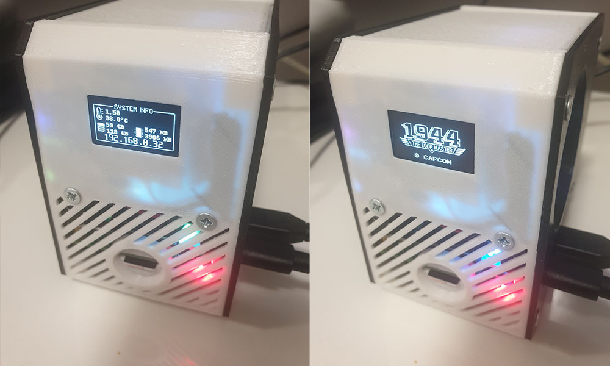

# RetroPie-OLED
Retropie OLED Display MOD version by Roby F.

Show Game Title on 128x64 OLED I2C Display for RetroPie v4.0.2+

## About
This script written in Python for RetroPie project (https://retropie.org.uk/) running on Raspberry Pi 2,3,4 which displays all necessary info on a 128x64 OLED I2C display

Thanks to members of Raspigamer forum for all the hard work (Duritz, losernator, RiNa, Yanubis, 까먹구, 꼬락이, 뇽가뤼, 다큰아이츄, 박군, 불친절한, 부천아저씨, 스트렌져, 유령군, 지껄러뷰, 쪼딩, 초단, 캡틴하록, 키티야, 허니버터꿀, 후루뚜뚜)

## How does it works
First, looking for title image from 'gametitle' folder with same filename of rom.
If no match, display title name from gamelist.xml(scraped metadata).
Could not find any info, then display the file name.

## Features

* IP address of eth0, wlan0
* CPU and GPU Temperature
* CPU realtime clock speed monitor and CPU usage percentage
* Emulator name and ROM information
* Title image of currently running romfile
* Double-byte character set support (Korean/Chinese/Japanese)
* CPU over temperature control

## Changelog

5/8/2020
* Added CPU realtime clock speed monitor
* Added GPU temperature monitor
* BugFix

7/8/2020
* Added CPU over temperature control, this feature checks when the CPU gets too hot.
  If the temperature reaches a range of 70/75 degrees, you are warned with an alarm on the display.
  If the temperature exceeds 75 degrees, the raspberry is automatically turned off.

## Development Environment
* Raspberry Pi 2, 3, 4
* RetroPie v4.0.2 and later
* 128x64 OLED I2C display

## Install
Step 1. Scrap metadata ( https://github.com/RetroPie/RetroPie-Setup/wiki/Scraper )

Step 2. Install Retropie-OLED Script
<pre><code>
cd ~
git clone https://github.com/rferrari81/RetroPie-OLED.git
cd ./RetroPie-OLED/
chmod 755 install.sh
./install.sh
</code></pre>

## Raspberry Pi I2C GPIO Pinout
FYI, VCC could be different by manufacturer (5v or 3.3v)

